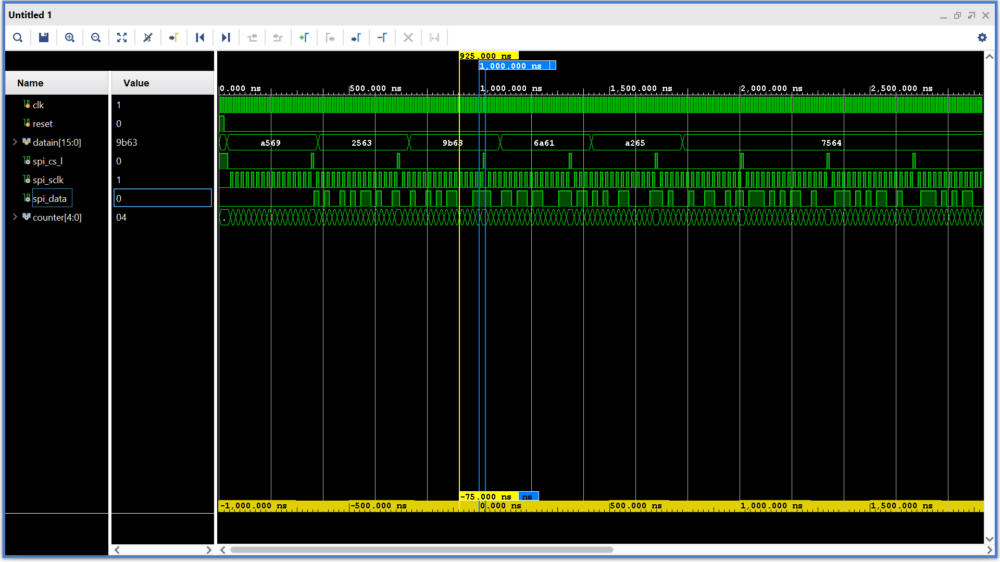

# SPI State Machine using Verilog

## Overview
This project implements a simple **SPI (Serial Peripheral Interface) Transmitter** using Verilog HDL.  
The design serially transmits 16-bit parallel input data through the SPI MOSI line using a finite state machine (FSM).

The project was simulated and verified in **Xilinx Vivado Simulator**.

---

## What is SPI?

SPI (Serial Peripheral Interface) is a synchronous serial communication protocol used for communication between:

- Microcontrollers
- Sensors
- ADC/DAC modules
- Memory devices
- FPGA peripherals

SPI mainly uses 4 signals:

| Signal | Description |
|---|---|
| MOSI | Master Out Slave In |
| MISO | Master In Slave Out |
| SCLK | Serial Clock |
| CS/SS | Chip Select |

This project implements:
- SPI Clock (`spi_sclk`)
- SPI Chip Select (`spi_cs_l`)
- SPI MOSI Data (`spi_data`)

---

## What This Code Does

The Verilog FSM performs the following operations:

1. Accepts a 16-bit parallel input (`datain`)
2. Converts the parallel data into serial format
3. Sends one bit at a time through `spi_data`
4. Generates SPI clock pulses (`spi_sclk`)
5. Controls SPI chip select (`spi_cs_l`)
6. Uses a counter to track transmitted bits

## Simulation Waveform




```bash
git clone https://github.com/rohitbaskey08/SPI-protocol.git
